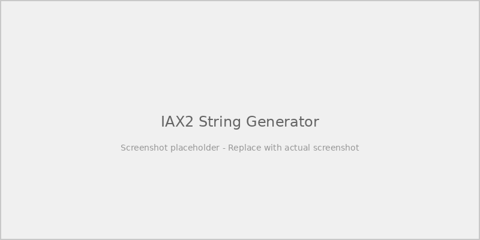

# RF-Link Node Quick Setup Guide (IAX Extension Method)

Register your RF-Link node as an IAX2 extension on FreeSTAR Everywhere.

---

## Online Configuration Tools

FreeSTAR Everywhere provides two helpful web-based tools to assist with configuring your AllStar node for IAX2 connections:

### IAX2 String Generator

The [IAX2 String Generator](https://freestareverywhere.com/apps/iax2string-generator/) helps you create the IAX2 dial string needed to connect to your AllStar node. Use this tool to generate the correct dial string format for your node configuration.



### IAX2 Config Generator

The [IAX2 Config Generator](https://freestareverywhere.com/apps/iax2config-generator/) helps you generate the configuration for your AllStar node's `iax.conf` and `extensions.conf` files. Simply enter your node details and the tool will create the correct configuration blocks for you.


---

## 1. Supply Your Credentials

Open a ticket with [https://support.freestareverywhere.com](https://support.freestareverywhere.com) and supply the PBX admin with the following information:
- **Callsign:** The callsign of the individual or club of the RF-link owner. 
- **Username:** The identifier you wish to use for your RF-Link node IAX extension. Normally the callsign.
- **Password:** The secret/password for this extension. At least 10 digits. STRONG PASSWORD!
- **IAX Port:** The UDP port you wish to use for IAX (usually 4569, or specify a custom port if required).
- **IAX String:** The string you need to provide the PBX admin to configure your extension. Use the [IAX2 String Generator](https://freestareverywhere.com/apps/iax2string-generator/) to create this.

The PBX admin will use these details to create your IAX extension.

---

## 2. Configure RF-Link Node Example (`/etc/asterisk/iax.conf`)

Use the [IAX2 Config Generator](https://freestareverywhere.com/apps/iax2config-generator/) to help generate this configuration, or manually create it as shown below:

```ini
;FreeSTAR Everywhere PBX Connection
[GB1ABC]                   ; <--- Replace with your IAX username/callsign, must match USERNAME, UPPERCASE  
username = USERNAME        ; <--- Replace with your IAX username/callsign, must match USERNAME, UPPERCASE
secret = PASSWORD          ; <--- Replace with your password for this RF-Link, STRONG PASSWORD
type = user
context = fsphone
disallow = all
allow = ulaw
transfer = no
```

---

## 3. Dialplan Example Setup (`/etc/asterisk/extensions.conf`)

Use the [IAX2 Config Generator](https://freestareverywhere.com/apps/iax2config-generator/) to help generate this configuration, or manually create it as shown below:

```ini
[fsphone]
exten => ${NODE},1,answer()
exten => ${NODE},n,Playback(rpt/Connecting)
exten => ${NODE},n,Wait(2)
exten => ${NODE},n,Playback(rpt/connected)
exten => ${NODE},n,Set(CALLSIGN=FS-${CALLERID(name)})
exten => ${NODE},n,rpt(${NODE}|P|${CALLSIGN})
exten => ${NODE},n,Hangup
```

---

## 4. Port Forwarding

Forward UDP port 4569 (or your custom port) to your node’s IP address if needed.

---

## 5. Reload Asterisk

```bash
asterisk -rx "dialplan reload"
asterisk -rx "iax2 reload"
```
Or use your control GUI’s "Reload" function.

---

## 6. Testing

- Dial your assigned extension from FreeSTAR Everywhere .
- Check monitoring for callsign display on your Allmon/supermon dashboard.
- Ensure credentials match PBX settings.

---

## Support

[https://support.freestareverywhere.com](https://support.freestareverywhere.com)
